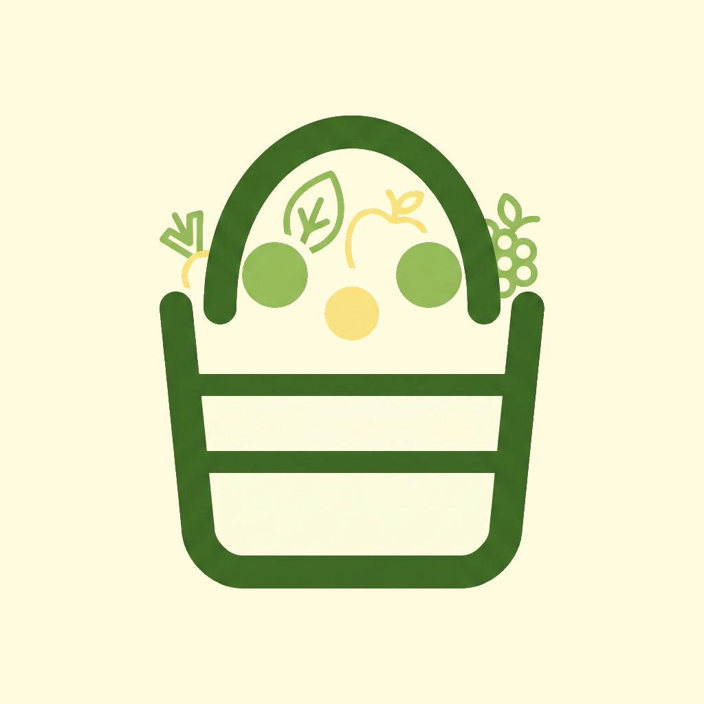

<p align="center">
  
</p>

<h1 align="center">CestApp</h1>

<p align="center">
  <strong>Receipt scanner that respects your privacy.</strong>
</p>

<p align="center">
  Scan receipts. Track spending. Keep your data local.
</p>

<p align="center">
  
  
  
  
  
  
  
</p>

---

> **🚧 Under Construction**
> CestApp is in active development. Core features work, but expect rough edges. Contributions welcome!

---

## Why CestApp?

- **100% on-device** — ML Kit OCR runs locally. No cloud uploads.
- **Any format** — Camera, gallery, or PDF.
- **Smart categories** — Auto-sorts items. Learns from your corrections.
- **Spanish supermarkets** — Pre-trained templates for Mercadona, Carrefour, Lidl, and more.
- **Multi-language** — English & Spanish UI.

## Features

**Capture**: Camera scanning, gallery import, PDF parsing via ML Kit OCR.

**Smart Parsing**: Chain-specific templates detect Mercadona, Carrefour, Lidl, Eroski, Dia, Consum, Alcampo, Aldi, HiperDino by NIF/name patterns.

**Organize**: 10 built-in categories, auto-categorization, user learning, store detection.

**Analyze**: Monthly trends, category breakdowns, store comparisons, top items.

**Privacy**: Offline-first, local SQLite, no tracking, no ads.

**Details**: Dark mode, Spanish regional formats (EUR, DD/MM/YYYY, decimal comma), smooth animations.

## Installation

```bash
git clone https://github.com/jaimebarreto/CestApp.git
cd CestApp
npm install

# Dev build required (ML Kit needs native code)
npx expo run:ios     # or
npx expo run:android
```

> Expo Go won't work. You need a development build.

## Tech Stack

| Category   | Technology                      |
| ---------- | ------------------------------- |
| Framework  | React Native 0.81 + Expo SDK 54 |
| Navigation | Expo Router                     |
| Styling    | NativeWind v4                   |
| Database   | Drizzle ORM + expo-sqlite       |
| State      | Zustand v5                      |
| OCR        | rn-mlkit-ocr                    |
| PDF        | Custom parser + pako            |
| i18n       | i18next                         |
| Animations | Reanimated v4                   |
| Charts     | react-native-gifted-charts      |

## Project Structure

```
app/           # Screens (Expo Router)
src/
  components/  # UI components
  db/          # Schema & queries
  services/    # OCR, PDF, capture, storage
  store/       # Zustand state
  i18n/        # Translations
```

## How It Works

1. **Detect Chain** — Identifies supermarket by NIF (tax ID), store name patterns, or fingerprints (brand names like "Hacendado" for Mercadona)
2. **Apply Template** — Uses chain-specific parsing rules (layout, item patterns, OCR corrections)
3. **Extract** — ML Kit OCR for images, custom parser for PDFs
4. **Categorize** — User corrections → keyword matching → default

Learning is store-aware: same item can have different categories at different stores.

**Supported Chains**: Mercadona, Carrefour, Lidl, Eroski, Dia, Consum, Alcampo, Aldi, HiperDino (with IGIC tax for Canarias).

## Contributing

1. Fork → branch → commit → PR
2. TypeScript strict mode
3. NativeWind for styling
4. `useTranslation()` for all text
5. Test iOS + Android + dark mode

## Roadmap

- Cloud sync
- Export (CSV, PDF)
- Budget alerts
- More languages
- Better OCR parsing
- Widgets

## License

MIT — see [LICENSE](LICENSE)

---

<p align="center">
  Made with care by <a href="https://github.com/jaimebg">JBGSoft - Jaime Barreto</a> 🧡
</p>
