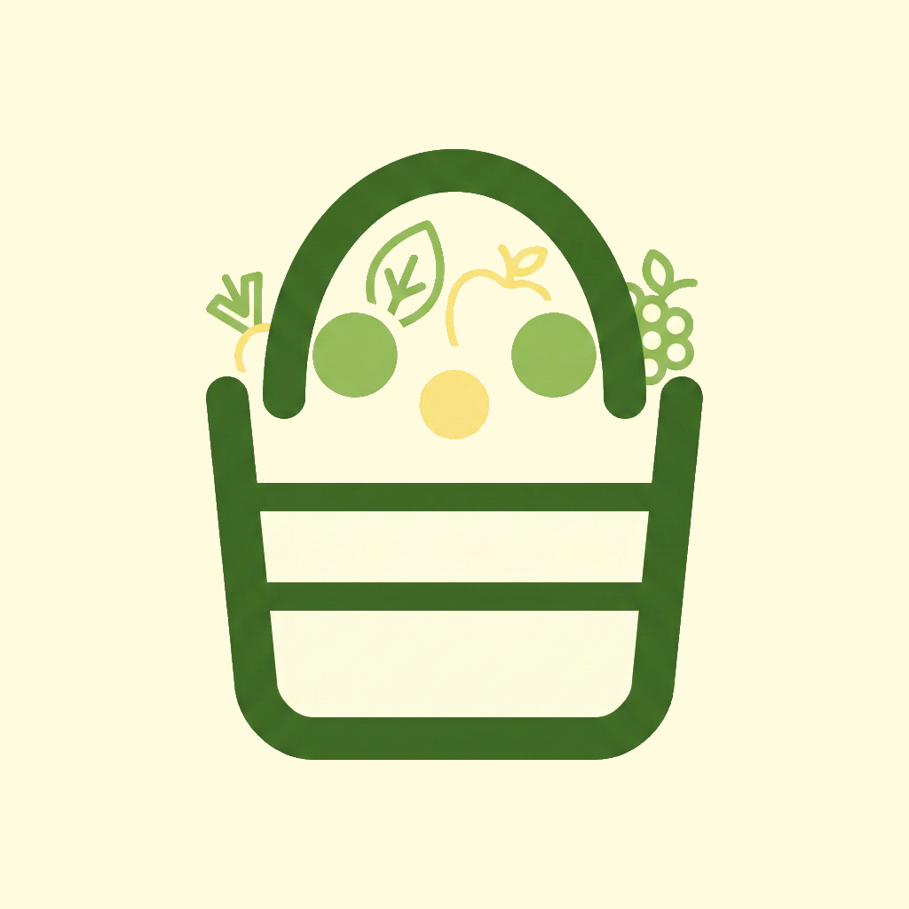
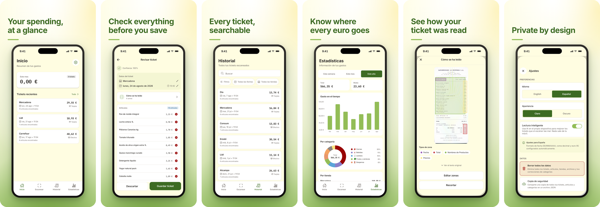

<p align="center">
  
</p>

<h1 align="center">CestApp</h1>

<p align="center">
  <strong>Receipt scanner for Spanish supermarkets that respects your privacy.</strong>
</p>

<p align="center">
  Scan receipts from Mercadona, Carrefour, Lidl, and more. Track spending. Keep your data local.
</p>

<p align="center">
  <a href="https://github.com/jaimebg/CestApp/releases/latest"></a>
  
  
  
  
  
  
  
</p>

---

<p align="center">
  
</p>

---

## Status

[1.0.0](https://github.com/jaimebg/CestApp/releases/tag/v1.0.0) is in review at the App Store and Google Play.

## Why CestApp?

- **100% on-device**: ML Kit OCR runs locally. No cloud uploads.
- **Any format**: Document scanner, gallery, or PDF.
- **Smart categories**: Auto-sorts items. Learns from your corrections.
- **Spanish supermarkets**: Pre-trained templates for Mercadona, Carrefour, Lidl, and more.
- **Multi-language**: English & Spanish UI.

## Features

**Capture**: Document scanner (auto-crop & enhance), gallery import, PDFs. CestApp reads a capture on the spot and opens it in review.

**Review**: Edit the store, date, total and every line before saving. "How it was read" shows the zones over the receipt and the recognized text. If the reading is off, redraw the zones or crop the image to the receipt, and CestApp reads it again. It warns you before you save a duplicate.

**Smart Parsing**: Chain-specific templates detect Mercadona, Carrefour, Lidl, Eroski, Dia, Consum, Alcampo, Aldi, HiperDino by NIF/name patterns.

**Smart reading** (iOS): On iPhones with Apple Intelligence, an on-device model repairs receipts the OCR read badly. CestApp keeps only the items it can match to the OCR text, and checks that their prices add up to the total.

**Organize**: 11 built-in categories, auto-categorization, user learning, store detection.

**Analyze**: Monthly trends, category breakdowns, store comparisons, top items.

**Privacy**: Offline-first, local SQLite, no tracking, no ads. Export everything to a JSON backup. Full policy: [jbgsoft.com/cestapp/privacy](https://jbgsoft.com/cestapp/privacy).

**Details**: Phone and tablet layouts, dark mode, Spanish regional formats (EUR, DD/MM/YYYY, decimal comma), animations that respect Reduce Motion.

## Installation

```bash
git clone https://github.com/jaimebg/CestApp.git
cd CestApp
npm install

# Dev build required (ML Kit needs native code)
npx expo run:ios     # or
npx expo run:android
```

> Expo Go won't work. You need a development build.

## Tech Stack

| Category   | Technology                        |
| ---------- | --------------------------------- |
| Framework  | React Native 0.86.2 + Expo SDK 57 |
| Navigation | Expo Router                       |
| Styling    | NativeWind v4                     |
| Database   | Drizzle ORM + expo-sqlite         |
| State      | Zustand v5                        |
| OCR        | ML Kit (@infinitered)             |
| LLM        | Apple Foundation Models (iOS)     |
| PDF        | Custom parser + pako              |
| i18n       | i18next                           |
| Animations | Reanimated v4                     |
| Charts     | react-native-gifted-charts        |

## Project Structure

```
app/           # Screens (Expo Router)
src/
  components/  # UI components
  config/      # Chain templates, tax regions
  db/          # Schema, migrations & queries
  services/    # OCR, PDF, capture, storage, LLM
  store/       # Zustand state
  theme/       # Palette & type
  i18n/        # Translations
scripts/
  store-screenshots/  # Frames raw captures into the store graphics
```

## Development

```bash
npx tsc --noEmit   # Type check
npm test           # Jest, including fixture-based parser tests
npm run check      # ESLint + Prettier
```

CI runs all three on every push. If you change the parser, extend the fixtures in `src/services/ocr/__tests__/`.

Releases build locally and ship through fastlane. The `fastlane/` folder holds credentials and store assets, so it stays out of the repo.

## How It Works

1. **Detect Chain**: Identifies supermarket by NIF (tax ID), store name patterns, or fingerprints (brand names like "Hacendado" for Mercadona)
2. **Apply Template**: Uses chain-specific parsing rules (layout, item patterns, OCR corrections)
3. **Extract**: ML Kit OCR for images, custom parser for PDFs. The parser uses the capture's zones when it has them, then the geometry of its text blocks, then its lines alone
4. **Categorize**: User corrections → keyword matching → default

Learning is store-aware: same item can have different categories at different stores.

**Supported Chains**: Mercadona, Carrefour, Lidl, Eroski, Dia, Consum, Alcampo, Aldi, HiperDino (with IGIC tax for Canarias).

## Contributing

1. Fork → branch → commit → PR
2. TypeScript strict mode
3. NativeWind for styling
4. `useTranslation()` for all text
5. Test iOS + Android + dark mode

## License

MIT. See [LICENSE](LICENSE).

---

<p align="center">
  Made with care by <a href="https://github.com/jaimebg">JBGSoft - Jaime Barreto</a> 🧡
</p>
